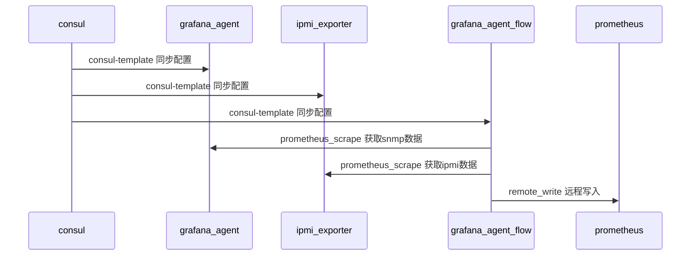

# WeOps-Proxy


* WeOps-Proxy 是一个跨云区域的proxy，具备在多个网络环境中分发snmp采集配置，并通过grafana-agent进行采集的能力。


# Overview




# Getting started

#### 安装

##### 1、weops proxy

```shell
export CONSUL_ADDR=127.0.0.1:8500
export PROMETHEUS_URL=http:\\127.0.0.1:9090
docker run -d -e CONSUL_ADDR=${CONSUL_ADDR} \
-e REMOTE_URL=${PROMETHEUS_URL}/api/v1/write \
--net=host --restart=always --name=weops-proxy \
-v /var/log/weopsproxy:/app/log \
docker-bkrepo.cwoa.net/ce1b09/weops-docker/weopsproxy:1.0.1
```

##### 2、python sdk

```shell
pip install -i https://bkrepo.cwoa.net/pypi/ce1b09/weops-pip/simple weopsproxy==1.0.1
```


#### 使用示例

```python
from weopsproxy.core import WeOpsProxyClient

client = WeOpsProxyClient(
            consul_host="127.0.0.1",
            consul_port="8500"
        )

CISCO_SNMP_CONFIG = """
get:
- 1.3.6.1.2.1.1.3.0
metrics:
- name: cw_CiscoSwitch_sysUpTime
  oid: 1.3.6.1.2.1.1.3
  type: gauge
  help: 设备运行时间
"""

client.put_snmp_v2_task(zone="default",
                        task_id="cisco_v2",
                        task_address="192.168.165.200",
                        task_config="cisco_cw",              
                        labels={"instance_name":"instance","instance_value":"114514"},
                        community="cisco")
```


[更多方法参考](python-sdk/test/test_main.py)
